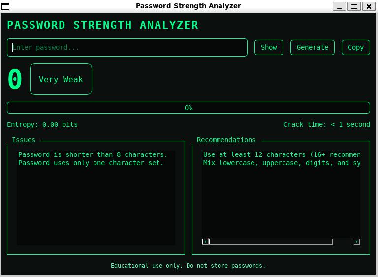
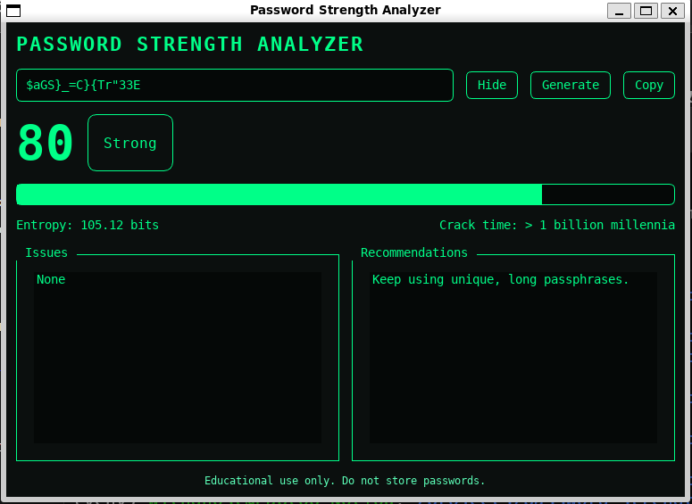

# 🔐 Password Strength Analyzer (PyQt5)

A modern, hacker-style GUI application that analyzes password strength using multiple security metrics.  
Built with **Python + PyQt5**, designed for **Cybersecurity portfolios**.

---

## 🚀 Features

- 🧠 Real-time password strength analysis
- 🔢 Entropy calculation
- 🧪 Pattern & dictionary detection
- 🚫 Common password checks
- 🎨 Dark / hacker-style UI
- 🖥️ Desktop GUI (WSL + X server supported)
- ⚠️ Educational & ethical use disclaimer

---

## 🖼️ Screenshots

### Main Interface


### Password Analysis


---

## 🛠️ Tech Stack

- Python 3.10+
- PyQt5
- Regex
- Custom entropy algorithm

---

## ⚙️ Installation (Ubuntu / WSL)

```bash
git clone https://github.com/akmaljonpolatov8/password-strength-analyzer.git
cd password-strength-analyzer
python3 -m venv venv
source venv/bin/activate
pip install -r requirements.txt
python src/main.py
